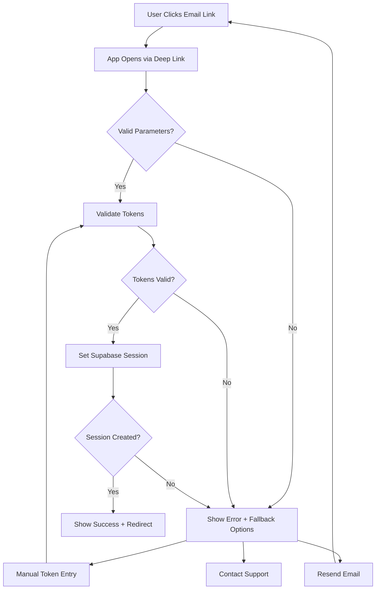

# Deep Linking Enhancement for Supabase Email Confirmation

**Project**: Labaku - Enhanced Email Confirmation Deep Linking  
**Platform**: React Native (Expo)  
**Last Updated**: December 2024  
**Status**: Planning Phase

## 📊 Overall Progress: 0% Complete

---

## 1. Product Overview

Enhance the existing Supabase email confirmation deep linking system in Labaku to provide a seamless, robust, and user-friendly email verification experience. The current implementation has basic functionality but lacks proper error handling, loading states, and comprehensive deep link management.

The enhanced system will improve user onboarding experience by providing better feedback, handling edge cases, and ensuring reliable email confirmation across different scenarios and devices.

**Platform Constraints:**
- Development is exclusively for iOS and Android platforms
- No web development or web platform support
- Bun is the only package manager used for this project

## 2. Core Features

### 2.1 Feature Module

Our deep linking enhancement consists of the following main improvements:

1. **Enhanced Confirmation Screen**: Improved UI/UX with better loading states, error handling, and success feedback
2. **Deep Link Handler**: Centralized deep link processing with comprehensive URL parameter validation
3. **Fallback Mechanisms**: Alternative confirmation methods when deep linking fails
4. **Progress Tracking**: Real-time status updates and user feedback during confirmation process
5. **Error Recovery**: Graceful error handling with actionable recovery options
6. **Security Enhancements**: Token validation and security checks for confirmation links

### 2.2 Page Details

| Page Name | Module Name | Feature Description |
|-----------|-------------|--------------------|
| Enhanced Confirm Screen | Loading State Management | Display animated loading indicators, progress messages, and estimated completion time during email confirmation process |
| Enhanced Confirm Screen | Error Handling System | Show specific error messages, provide recovery actions, and offer alternative confirmation methods when deep linking fails |
| Enhanced Confirm Screen | Success Feedback | Display celebration animations, welcome messages, and smooth transition to main app after successful confirmation |
| Deep Link Handler | URL Parameter Validation | Validate access_token, refresh_token, type, and other parameters from confirmation URLs with comprehensive error checking |
| Deep Link Handler | Token Security Validation | Verify token authenticity, expiration, and format before processing confirmation to prevent security vulnerabilities |
| Deep Link Handler | Redirect Management | Handle proper navigation flow based on confirmation status and user state with fallback routes |
| Fallback Confirmation | Manual Token Entry | Provide manual token input option when automatic deep linking fails or is unavailable |
| Fallback Confirmation | Resend Email Option | Allow users to request new confirmation emails with rate limiting and status tracking |
| Progress Tracker | Real-time Status Updates | Show step-by-step confirmation progress with visual indicators and status messages |
| Progress Tracker | Analytics Integration | Track confirmation success rates, failure points, and user journey analytics for optimization |

## 3. Core Process

### Enhanced Email Confirmation Flow

1. **User Registration**: User signs up with email and password
2. **Email Sent**: Supabase sends confirmation email with deep link (labaku://auth/confirm)
3. **Deep Link Processing**: App receives and validates deep link parameters
4. **Token Validation**: System validates access_token and refresh_token security
5. **Confirmation Processing**: Supabase session is established with validated tokens
6. **Success Handling**: User sees success message and is redirected to main app
7. **Error Recovery**: If any step fails, user is provided with recovery options

### Fallback Flow (when deep linking fails)

1. **Detection**: System detects deep link failure or invalid parameters
2. **Manual Option**: User is presented with manual token entry option
3. **Resend Email**: User can request new confirmation email
4. **Support Contact**: User can access help/support if issues persist

## 4. User Interface Design

### 4.1 Design Style

- **Primary Colors**: Soft green (#10B981), White (#FFFFFF)
- **Secondary Colors**: Gray variants (#F3F4F6, #6B7280, #374151)
- **Accent Colors**: Blue (#3B82F6) for links, Red (#EF4444) for errors
- **Button Style**: Rounded corners (8px), soft shadows, gentle hover effects
- **Typography**: Inter font family, 16px base size, 1.5 line height
- **Layout Style**: Card-based design with generous padding and clean spacing
- **Icons**: Feather icons for consistency, animated loading spinners
- **Animations**: Smooth transitions (300ms), fade-in effects, success celebrations

### 4.2 Page Design Overview

| Page Name | Module Name | UI Elements |
|-----------|-------------|-------------|
| Enhanced Confirm Screen | Loading State | Animated spinner (soft green), progress text, estimated time remaining, step indicators |
| Enhanced Confirm Screen | Error Display | Red error icon, clear error message, action buttons (retry, manual entry, resend), help link |
| Enhanced Confirm Screen | Success State | Green checkmark animation, welcome message, "Continue to App" button, celebration micro-animation |
| Deep Link Handler | Processing Overlay | Transparent overlay, centered loading indicator, "Processing confirmation..." text |
| Fallback Confirmation | Manual Entry Form | Input field for token, paste button, validation feedback, submit button |
| Fallback Confirmation | Resend Email | Email input field, "Resend" button, countdown timer, status message |

### 4.3 Responsiveness

Mobile-first design optimized for iOS and Android devices with touch-friendly interactions, proper keyboard handling, and adaptive layouts for different screen sizes.

---

## 📋 Implementation Checklist & Progress Tracker

### ✅ Phase 1: Analysis & Planning (COMPLETED - 100%)
- [x] Analyze existing email confirmation implementation
- [x] Review current deep linking setup in app.json
- [x] Identify improvement areas and pain points
- [x] Create comprehensive requirements document
- [x] Design enhanced user flow and error handling

### 🔄 Phase 2: Enhanced Confirmation Screen (IN PROGRESS - 0%)
**Estimated Time**: 2-3 hours

#### 2.1 UI/UX Improvements
- [ ] **Loading State Enhancement** (30 min)
  - [ ] Add animated loading spinner with soft green color
  - [ ] Implement progress text with dynamic messages
  - [ ] Add estimated time remaining indicator
  - [ ] Create step-by-step progress visualization

- [ ] **Error Handling UI** (45 min)
  - [ ] Design comprehensive error message display
  - [ ] Add specific error types (network, token, session)
  - [ ] Implement action buttons for error recovery
  - [ ] Create help/support contact options

- [ ] **Success State Design** (30 min)
  - [ ] Add celebration animation for successful confirmation
  - [ ] Design welcome message with user personalization
  - [ ] Implement smooth transition to main app
  - [ ] Add "Continue to App" call-to-action button

#### 2.2 Logic Enhancements
- [ ] **Parameter Validation** (45 min)
  - [ ] Validate all URL parameters before processing
  - [ ] Check token format and structure
  - [ ] Verify confirmation type parameter
  - [ ] Handle missing or malformed parameters

- [ ] **Security Improvements** (30 min)
  - [ ] Add token expiration checking
  - [ ] Implement rate limiting for confirmation attempts
  - [ ] Add CSRF protection for confirmation process
  - [ ] Validate token authenticity with Supabase

### ⏳ Phase 3: Deep Link Handler Enhancement (PENDING - 0%)
**Estimated Time**: 2-3 hours

#### 3.1 Centralized Deep Link Processing
- [ ] **URL Handler Service** (60 min)
  - [ ] Create centralized deep link processing service
  - [ ] Implement URL parameter extraction and validation
  - [ ] Add support for multiple confirmation types
  - [ ] Handle malformed or incomplete URLs

- [ ] **Navigation Management** (45 min)
  - [ ] Implement smart routing based on confirmation status
  - [ ] Add fallback navigation for failed confirmations
  - [ ] Handle deep link conflicts with existing navigation
  - [ ] Ensure proper back navigation behavior

#### 3.2 Error Recovery System
- [ ] **Fallback Mechanisms** (60 min)
  - [ ] Implement manual token entry option
  - [ ] Add resend email functionality with rate limiting
  - [ ] Create alternative confirmation methods
  - [ ] Provide clear recovery instructions

- [ ] **Analytics Integration** (30 min)
  - [ ] Track confirmation success/failure rates
  - [ ] Monitor deep link performance
  - [ ] Log error types and frequency
  - [ ] Measure user journey completion

### ⏳ Phase 4: Supabase Integration Enhancement (PENDING - 0%)
**Estimated Time**: 1-2 hours

#### 4.1 Session Management
- [ ] **Enhanced Session Handling** (45 min)
  - [ ] Improve session validation logic
  - [ ] Add session persistence verification
  - [ ] Implement automatic session refresh
  - [ ] Handle concurrent session conflicts

- [ ] **Auth Store Integration** (30 min)
  - [ ] Update auth store with enhanced session data
  - [ ] Add confirmation status tracking
  - [ ] Implement user state synchronization
  - [ ] Handle auth state edge cases

#### 4.2 Email Configuration
- [ ] **Email Template Enhancement** (15 min)
  - [ ] Verify email redirect URL configuration
  - [ ] Test email delivery and link generation
  - [ ] Ensure consistent branding in emails
  - [ ] Add email template customization

### ⏳ Phase 5: Testing & Validation (PENDING - 0%)
**Estimated Time**: 2-3 hours

#### 5.1 Functional Testing
- [ ] **Happy Path Testing** (30 min)
  - [ ] Test successful email confirmation flow
  - [ ] Verify proper navigation after confirmation
  - [ ] Test session persistence after confirmation
  - [ ] Validate user state updates

- [ ] **Error Scenario Testing** (60 min)
  - [ ] Test expired token handling
  - [ ] Test malformed URL parameters
  - [ ] Test network failure scenarios
  - [ ] Test concurrent confirmation attempts

- [ ] **Mobile-Specific Testing** (45 min)
  - [ ] Test app backgrounding during confirmation on iOS/Android
  - [ ] Test deep link when app is closed on both platforms
  - [ ] Test multiple confirmation emails across mobile email clients
  - [ ] Test confirmation on different iOS and Android devices

#### 5.2 User Experience Testing
- [ ] **Usability Testing** (30 min)
  - [ ] Test loading state visibility and clarity on mobile screens
  - [ ] Verify error message comprehensibility on iOS/Android
  - [ ] Test recovery action effectiveness with touch interactions
  - [ ] Validate success state satisfaction on mobile devices

- [ ] **Performance Testing** (15 min)
  - [ ] Measure confirmation processing time on iOS/Android
  - [ ] Test app responsiveness during confirmation on mobile
  - [ ] Verify memory usage during process on resource-constrained devices
  - [ ] Check for any platform-specific performance bottlenecks

### ⏳ Phase 6: Documentation & Deployment (PENDING - 0%)
**Estimated Time**: 1 hour

#### 6.1 Documentation
- [ ] **Technical Documentation** (30 min)
  - [ ] Document new deep link handling process
  - [ ] Create troubleshooting guide for common issues
  - [ ] Update API documentation for confirmation flow
  - [ ] Document security considerations

- [ ] **User Documentation** (15 min)
  - [ ] Create user guide for email confirmation
  - [ ] Document fallback options for users
  - [ ] Add FAQ for common confirmation issues
  - [ ] Create support contact information

#### 6.2 Deployment Preparation
- [ ] **Code Review** (15 min)
  - [ ] Review all code changes for quality
  - [ ] Ensure proper error handling coverage
  - [ ] Verify security implementation
  - [ ] Check for any remaining TODOs
  - [ ] Verify iOS/Android platform-specific code
  - [ ] Confirm all package dependencies use Bun

---

## 🎯 Success Metrics

### Primary Metrics
- **Confirmation Success Rate**: Target 95%+ successful email confirmations on iOS/Android
- **User Drop-off Reduction**: Reduce confirmation abandonment by 50% on mobile platforms
- **Error Recovery Rate**: 80%+ of users successfully recover from errors on mobile devices
- **Time to Confirmation**: Average confirmation time under 30 seconds on mobile

### Secondary Metrics
- **User Satisfaction**: Positive feedback on mobile confirmation experience
- **Support Ticket Reduction**: Decrease mobile confirmation-related support requests
- **Deep Link Reliability**: 99%+ deep link processing success on iOS/Android
- **Performance Impact**: No significant impact on mobile app startup time
- **Platform Compatibility**: 100% feature parity between iOS and Android

---

## 🔧 Technical Requirements

### Platform Support
- **iOS**: Native iOS development through Expo
- **Android**: Native Android development through Expo
- **Web**: Not supported - excluded from development

### Dependencies
- **Existing**: @supabase/supabase-js, expo-router, zustand
- **Additional**: expo-linking (for enhanced deep link handling)
- **Development**: None required

### Package Management
- **Bun**: Exclusive package manager for all operations
- All installation commands use `bun install`
- All script execution uses `bun run`

### Configuration Updates
- **app.json**: Verify URL scheme configuration for iOS/Android
- **metro.config.js**: Configure for iOS/Android platforms only (exclude web)
- **Supabase**: Configure redirect URLs for mobile deep linking
- **Environment**: Add any new environment variables if needed

### Security Considerations
- Token validation and expiration checking
- Rate limiting for confirmation attempts
- CSRF protection for confirmation endpoints
- Secure storage of confirmation state

### Development Rules
- Follow React Native best practices
- Implement proper error handling
- Use TypeScript for type safety
- Follow Expo development guidelines
- Implement comprehensive logging
- **Platform-specific**: Target iOS and Android only
- **Package Management**: Use Bun exclusively for all package operations
- **No Web Support**: Exclude web platform from builds and configurations

---

## 📝 Notes & Considerations

### Current Implementation Analysis
- Basic email confirmation is functional but lacks robust error handling
- URL scheme 'labaku' is properly configured in app.json
- Supabase client has detectSessionInUrl set to false (may need review)
- Auth store integration exists but could be enhanced

### Potential Challenges
- Handling deep links when mobile app is completely closed
- Managing confirmation state across mobile app restarts
- Ensuring consistent behavior across iOS and Android platforms
- Balancing security with user experience on mobile devices
- iOS App Store and Google Play Store compliance requirements
- Device-specific deep linking behaviors and limitations
- Package management consistency using Bun across development team

### Future Enhancements
- **Biometric Confirmation**: Add Touch ID/Face ID (iOS) and fingerprint (Android) for additional security
- **Offline Support**: Handle confirmations when mobile device is offline
- **Multi-language Support**: Localize confirmation messages for global mobile users
- **Analytics Integration**: Track mobile confirmation funnel metrics
- **Push Notification Fallback**: Alternative confirmation method for mobile devices
- **Platform-Specific Features**: Leverage iOS/Android native capabilities for enhanced UX
- **Performance Optimization**: Mobile-specific performance improvements and battery optimization

---

**Total Estimated Development Time**: 8-12 hours  
**Priority Level**: High  
**Dependencies**: None (can start immediately)  
**Risk Level**: Low (enhancement of existing functionality)
